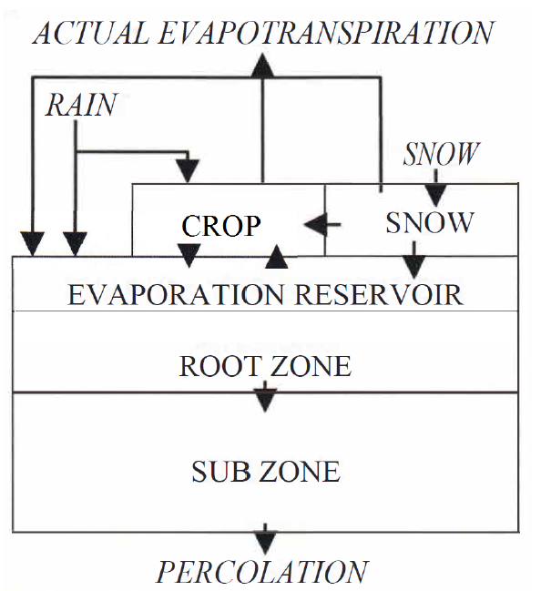

## Welcome to Edcrop

Edcrop is a Python package for simulating evapotranspiration and drainage from a field on the basis of 
climatic data and builds off of the Evacrop program (Olesen and Heidmann, 2002).

Edcrop is short for “Evapotranspiration and Drainage from CROP, wetland, or forest”.

To do simulation, Edcrop requires input of climatic time series and of soil and vegetation parameters. Figure 1 visualizes the conceptualization, being similar to that of the Evacrop model by Olesen and Heidmann (2002), which built on the Watcros model by Aslyng and Hansen (1982). Basis of the conceptualization are considerations regarding the important physical processes that turn precipitation into either evapotranspiration or drainage. The conceptualization of processes is formulated as equations that are often semi-empirical (Olesen and Heidmann, 2002). The considerations are the following:

1. Precipitation falls as either rain or snow. When it falls as snow, it accumulates on the vegetation or on the ground. Snow evaporates, or it melts, infiltrates, and becomes available for plant roots or for drainage.
1. Part of the precipitation is intercepted by the leaves (and branches) of the vegetation, while the rest falls on the ground. There is a limit to how much water can be intercepted by the vegetation. Intercepted water will be available to evaporation.
1. Rain falling or snow thawing on the ground infiltrates the surface. The infiltrated water can evaporate, be captured by plant roots and transpired, be stored in the soil, or drainage if the water content exceeds field capacity of the soil.
1. During the life cycle of vegetation, leaf area and root depth may develop and disappear. This determines interception of precipitation, absorption of infiltrated water by plant roots, and distribution of potential evapotranspiration between vegetation and soil.
1. Intercepted water and soil water evaporate when potential evaporation is available for either or both.
1. Water will transpire from the stomata of the green leaf area when intercepted water has evaporated and potential transpiration is available.
1. The life cycle of a crop depends on climatic and other parameters. However, growing degree-days can often be used as a fair predictor for crop growth.
1. Growing of a tree is also growing degree-day dependent, but the dependency is very different for different tree species (Murray et al., 1989). Since a forest often contains a mix of tree species, as an approximation, growth of a mixed forest may be described by a calendar.

The following expands these considerations and turns them into equations that can be solved in sequence to calculate how a time series of precipitation turns into time series of actual evapotranspiration and drainage. For simplification, we assume that the following are available: time series of daily precipitation, mean temperature, and reference evaporation; soil data; and vegetation data. The required soil and vegetation data will be explained below.

The water balance calculation is carried out in daily time steps. The daily water balance calculations involve six model elements for which a sequence of equations needs to be solved. When solved for a particular day, the calculations proceed to the following day.

There is also a seventh model element, modeling of vegetation growth. Edcrop models growth independently from the water balance by predicting growth from alone either growing degree-days or a calendar.

**Figure 1** The Evacrop conceptualization of evapotranspiration and percolation (drainage) from a field with a crop. (Modified from Olesen and Heidmann, 2002.) The soil profile has depth maxz, which is divided into four subintervals of equal thickness but different soil parameters. The depth of the root zone changes over the growing season.